# CinemaSeat --- Scalable Cinema Ticket Booking System

A scalable and reliable cinema ticket booking platform built for **Zero
to Production --- Phase 2: The Ultimate Hackathon**.

The system is designed around the central challenge of the contest:
handling sudden high-concurrency demand for popular seats while ensuring
that **the same seat is never sold twice**.

## Team

**Team:** Team_Cha_Coffee

**Repository:** cinemaseat

**Hackathon:** Zero to Production --- Phase 2: The Ultimate Hackathon

**Date:** 8 August 2026

------------------------------------------------------------------------

## Table of contents

-   [Problem understanding](#problem-understanding)
-   [Project goals](#project-goals)
-   [Core features](#core-features)
-   [Architecture](#architecture)
-   [Concurrency and seat-booking
    strategy](#concurrency-and-seat-booking-strategy)
-   [Payment and OTP gateway](#payment-and-otp-gateway)
-   [Booking lifecycle](#booking-lifecycle)
-   [Hold expiration](#hold-expiration)
-   [Tech stack](#tech-stack)
-   [Data model](#data-model)
-   [API](#api)
-   [Frontend experience](#frontend-experience)
-   [Testing and proof](#testing-and-proof)
-   [Deployment](#deployment)
-   [CI/CD](#cicd)
-   [Repository structure](#repository-structure)
-   [Environment variables](#environment-variables)
-   [Local development](#local-development)
-   [Docker setup](#docker-setup)
-   [Judge verification](#judge-verification)
-   [Engineering decisions](#engineering-decisions)
-   [Known limitations](#known-limitations)
-   [Team contributions](#team-contributions)
-   [Attribution](#attribution)

------------------------------------------------------------------------

## Problem understanding

Blockbuster movie releases can create extreme traffic spikes when
thousands of users try to book the same showtime and compete for the
same popular seats.

The challenge is not simply to build a movie ticket website. The system
must remain usable under pressure, handle unreliable payment/OTP
behavior, automatically release abandoned holds, and most importantly:

> **Never sell the same seat twice.**

The contest requires a cinema ticketing platform that can:

-   Browse movies, showtimes, and theatres.
-   Display a live seat map.
-   Hold a seat.
-   Complete payment and confirm a booking.
-   Automatically release a hold when payment is not completed in time.
-   Handle heavy concurrent demand without double-booking.
-   Integrate with the provided payment and OTP gateway.
-   Be containerized, tested, deployable, and reproducible from a clean
    clone.

No cinema admin portal is required. Movies, theatres, showtimes, seat
layouts, and prices are pre-populated.

------------------------------------------------------------------------

## Project goals

The project focuses on five engineering priorities:

1.  **Correctness under concurrency** --- exactly one user should win
    when many users request the same seat simultaneously.
2.  **Reliable asynchronous payment handling** --- payment completion is
    driven by gateway callbacks rather than blocking the booking
    request.
3.  **Idempotency** --- duplicate payment callbacks must not create
    duplicate bookings or payments.
4.  **Automatic hold expiration** --- unpaid seats return to the
    available pool after a configurable TTL.
5.  **Production-ready delivery** --- Docker, CI/CD, deployment,
    documentation, and reproducible setup.

------------------------------------------------------------------------

## Core features

### Customer features

-   Browse movies.
-   Browse theatres and showtimes.
-   View the seat map for a showtime.
-   Select and hold a seat.
-   See the hold expiration countdown.
-   Initiate payment.
-   Receive booking confirmation after successful payment.
-   See booking/payment status.

### Reliability features

-   Database-backed seat state.
-   Concurrency-safe seat holding.
-   Row-level locking for conflicting seat requests.
-   Configurable `HOLD_TTL_SECONDS`.
-   Automatic release of expired holds.
-   Asynchronous payment processing.
-   Idempotent payment callbacks.
-   Safe handling of duplicate callbacks.
-   Safe handling of payment failures and gateway timeouts.
-   Health endpoint independent of gateway availability.

### Engineering features

-   React frontend.
-   Django REST Framework backend.
-   PostgreSQL database.
-   Provided mock payment/OTP gateway.
-   Docker Compose.
-   Automated tests.
-   GitHub Actions CI/CD.
-   Deployed application.
-   Architecture and engineering-decision documentation.

------------------------------------------------------------------------

## Architecture

The project uses a **single Django/DRF backend** rather than multiple
microservices. This keeps the architecture simple enough to build and
operate during the hackathon while still allowing the core booking,
payment, and concurrency logic to be isolated into modules.

!


### High-level request flow

``` text
React frontend
      |
      | REST API
      v
Django REST Framework
      |
      +--------------------+
      |                    |
      v                    v
 PostgreSQL          Mock Gateway
      |              Payment / OTP
      |
      v
Seat / Hold / Booking state
```

The database is the source of truth for seat availability and booking
state.

------------------------------------------------------------------------

## Concurrency and seat-booking strategy

Concurrency correctness is the most important part of the system.

The critical scenario is:

``` text
100 users
   |
   |  same showtime
   |  same seat
   v
POST /holds/
```

Expected result:

``` text
Requests sent       = 100
Successful holds    = 1
Rejected requests   = 99
Oversell count      = 0
```

### Why row locking is used

Two users may send a hold request at almost exactly the same time.
Application-level checks alone can produce a race condition:

``` text
User A checks seat → AVAILABLE
User B checks seat → AVAILABLE
User A updates     → HELD
User B updates     → HELD
```

To prevent this, the backend performs the critical seat state transition
inside a database transaction and locks the requested `ShowSeat` row
while checking and updating it.

Conceptually:

``` text
BEGIN TRANSACTION
       |
       v
Lock requested ShowSeat row
       |
       v
Check current status
       |
   +---+---+
   |       |
AVAILABLE  HELD/BOOKED
   |       |
   v       v
Create    Reject
hold
   |
   v
COMMIT
```

The database therefore becomes the final authority over who wins the
seat.

------------------------------------------------------------------------

## Payment and OTP gateway

The contest provides a shared mock gateway. The project integrates the
provided gateway instead of creating a custom payment mock.

The gateway exposes:

``` text
POST /charge
POST /refund
POST /otp/send
POST /otp/verify
GET  /health
```

The `/charge` request accepts:

``` text
amount
currency
booking_ref
callback_url
```

The gateway initially returns a pending payment and later calls the
supplied callback URL.

### Gateway behavior handled by this project

The system is designed for:

-   Callback delays.
-   Payment failures.
-   Duplicate callbacks.
-   `/charge` timeout/500 responses.
-   Delayed or missing OTP delivery.
-   Callback arriving before `/charge` returns.

### Important callback rule

The payment callback always returns HTTP `200`, including when the
callback has already been processed.

Duplicate callbacks are detected using an idempotency mechanism so that:

-   A payment is not created twice.
-   A booking is not confirmed twice.
-   Revenue is not counted twice.

------------------------------------------------------------------------

## Booking lifecycle

A normal booking follows:

``` text
AVAILABLE
    |
    | hold
    v
HELD
    |
    | payment succeeds
    v
BOOKED
```

If payment fails or the hold expires:

``` text
HELD
   |
   +---- payment FAILED ----+
   |                         |
   +---- TTL EXPIRED --------+
                             |
                             v
                         AVAILABLE
```

A successful payment callback:

``` text
Gateway
   |
   | SUCCEEDED callback
   v
Django callback endpoint
   |
   v
Verify event/idempotency
   |
   v
Confirm booking
   |
   v
BOOKED
```

------------------------------------------------------------------------

## Hold expiration

The hold duration is controlled by an environment variable:

``` text
HOLD_TTL_SECONDS
```

It is intentionally not hardcoded because judges will run the
application with a short TTL.

Example:

``` env
HOLD_TTL_SECONDS=30
```

Test scenario:

``` text
10:00:00  User A holds F12
10:00:30  Hold expires
10:00:31  F12 becomes AVAILABLE
10:00:35  User B successfully holds F12
```

This demonstrates that abandoned seats are automatically returned to the
available pool.

------------------------------------------------------------------------

## Tech stack

### Frontend

-   React
-   JavaScript/TypeScript
-   REST API integration
-   Responsive seat-map interface

### Backend

-   Python
-   Django
-   Django REST Framework

### Database

-   PostgreSQL
-   Database transactions
-   Row-level locking for seat contention

### Infrastructure

-   Docker
-   Docker Compose
-   GitHub Actions
-   Poridhi VM deployment

### Testing

-   Django/DRF tests
-   Concurrency/load testing
-   Gateway failure-mode testing
-   Hold-expiration testing

------------------------------------------------------------------------

## Data model

The core data model is intentionally simple.

### Movie

``` text
Movie
-----
id
title
description
duration
```

### Theatre

``` text
Theatre
-------
id
name
location
```

### Showtime

``` text
Showtime
--------
id
movie_id
theatre_id
start_time
```

### Seat

``` text
Seat
----
id
theatre_id
row
number
```

### ShowSeat

This is the central seat-state table.

``` text
ShowSeat
--------
id
showtime_id
seat_id
status
hold_id
hold_expires_at
booking_id
```

Possible states:

``` text
AVAILABLE
HELD
BOOKED
```

### Hold

``` text
Hold
----
id
showtime_id
seat_id
user/session reference
expires_at
status
```

### Booking

``` text
Booking
-------
id
showtime_id
seat_id
amount
status
payment_id
created_at
```

### Payment

``` text
Payment
-------
id
booking_id
gateway_payment_id
amount
status
created_at
updated_at
```

### Payment event / idempotency record

``` text
PaymentEvent
------------
id
event_id
payment_id
booking_ref
status
processed_at
```

The exact implementation may combine or separate these tables depending
on the final backend implementation.

------------------------------------------------------------------------
## API

The application exposes REST endpoints for browsing movies and showtimes, viewing seat maps, creating seat holds, sending and verifying OTPs, initiating payments, and checking booking status.

All endpoints are available under:

`http://127.0.0.1:8000`

The Django REST Framework API uses JSON for requests and responses. No authentication headers are required (`AllowAny`).

### Health

```text
GET /api/health/
```

Expected response:

```text
HTTP 200
{"status": "ok", "db": "ok"}
```

The health endpoint DB-probes via a single `SELECT 1` and is
deliberately gateway-free — it must remain responsive even when the
payment gateway is unavailable. Designed for load-balancer / orchestrator
probes.

### API Endpoints

| Method | URL                               | Body                                                    | Response                                                                               |
| ------ | --------------------------------- | ------------------------------------------------------- | -------------------------------------------------------------------------------------- |
| `GET`  | `/api/movies/`                    | —                                                       | `[{"id":1,"title":"...","poster_url":"..."}, ...]`                                     |
| `GET`  | `/api/showtimes/?movie_id=1`      | —                                                       | `[{"id":1,"movie":1,"theatre":"...","starts_at":"...","base_price":"350.00"}, ...]`    |
| `GET`  | `/api/showtimes/1/seats/`         | —                                                       | `[{"id":7,"label":"A1","status":"AVAILABLE","price":"350.00"}, ...]`                   |
| `POST` | `/api/bookings/hold/`             | `{"showtime_id":1,"seat_ids":[7,8],"phone":"+1555..."}` | `201` → `{"booking_id":"bk_...","status":"HELD","expires_at":"...","seats":[...]}`     |
| `GET`  | `/api/bookings/<ref>/`            | —                                                       | `{"booking_id":"...","status":"HELD","expires_at":"...","seats":[...]}`                |
| `POST` | `/api/bookings/<ref>/otp/send/`   | —                                                       | `202` → `{"booking_id":"...","otp_ref":"otp_...","status":"SENT"}`                     |
| `POST` | `/api/bookings/<ref>/otp/verify/` | `{"code":"123456"}`                                     | `200` (verified) or `400` (invalid)                                                    |
| `POST` | `/api/bookings/<ref>/pay/`        | —                                                       | `202` → `{"booking_id":"...","payment_id":"...","status":"PENDING","amount":"700.00"}` |
| `POST` | `/api/webhooks/payment/`          | gateway-only (HMAC `X-Signature`)                       | `200` (always; duplicates & missing fields accepted)                                 |
| `POST` | `/api/webhooks/otp/`              | gateway-only (HMAC `X-Signature`)                       | `200` (always; stashes delivered code on `OtpVerification`)                          |

The two `/api/webhooks/` endpoints are unauthenticated but **HMAC-signed**
when `GATEWAY_SECRET` is set in the environment. The gateway computes
`HMAC-SHA256(secret, raw_body)` and sends it as `X-Signature`. A missing
or invalid signature returns `401`; an empty `GATEWAY_SECRET` disables
verification (local dev only).

The `/pay/` endpoint forwards an `Idempotency-Key` header to the
gateway on every charge call (and stores the same key on the local
`Payment` row for audit). A retry of `/pay/` for the same booking
**reuses** the existing key — so the gateway can dedupe.

### Booking Flow

The normal customer booking flow is:

1. `GET /api/movies/` — Get movies.
2. `GET /api/showtimes/?movie_id=1` — Get showtimes for a movie.
3. `GET /api/showtimes/1/seats/` — Get the seat map.
4. `POST /api/bookings/hold/` — Hold one or more seats.
5. `GET /api/bookings/<ref>/` — Check the booking.
6. `POST /api/bookings/<ref>/otp/send/` — Send OTP.
7. `POST /api/bookings/<ref>/otp/verify/` — Verify OTP.
8. `POST /api/bookings/<ref>/pay/` — Initiate payment.
9. `GET /api/bookings/<ref>/` — Check the booking/payment status.

### Example: Fetch Movies

```bash
curl http://127.0.0.1:8000/api/movies/
```

### Example: Fetch Showtimes

```bash
curl "http://127.0.0.1:8000/api/showtimes/?movie_id=1"
```

### Example: Fetch Seat Map

```bash
curl http://127.0.0.1:8000/api/showtimes/1/seats/
```

Example response:

```json
[
  {
    "id": 7,
    "label": "A1",
    "status": "AVAILABLE",
    "price": "350.00"
  }
]
```

### Example: Hold Seats

```bash
curl -X POST http://127.0.0.1:8000/api/bookings/hold/ \
  -H "Content-Type: application/json" \
  -d '{
    "showtime_id": 1,
    "seat_ids": [7, 8],
    "phone": "+1555..."
  }'
```

Expected response:

```text
HTTP 201
```

```json
{
  "booking_id": "bk_...",
  "status": "HELD",
  "expires_at": "...",
  "seats": []
}
```

### Example: Check Booking

```bash
curl http://127.0.0.1:8000/api/bookings/<ref>/
```

### Example: Send OTP

```bash
curl -X POST \
  http://127.0.0.1:8000/api/bookings/<ref>/otp/send/
```

Expected response:

```text
HTTP 202
```

```json
{
  "booking_id": "...",
  "otp_ref": "otp_...",
  "status": "SENT"
}
```

### Example: Verify OTP

```bash
curl -X POST \
  http://127.0.0.1:8000/api/bookings/<ref>/otp/verify/ \
  -H "Content-Type: application/json" \
  -d '{
    "code": "123456"
  }'
```

Expected responses:

```text
HTTP 200 → OTP verified
HTTP 400 → Invalid OTP
```

### Example: Initiate Payment

```bash
curl -X POST \
  http://127.0.0.1:8000/api/bookings/<ref>/pay/
```

Expected response:

```text
HTTP 202
```

```json
{
  "booking_id": "...",
  "payment_id": "...",
  "status": "PENDING",
  "amount": "700.00"
}
```

------------------------------------------------------------------------

## Frontend experience

The frontend focuses on the core booking path rather than unnecessary
visual complexity.

### Main flow

``` text
Movies
   ↓
Select Showtime
   ↓
Live Seat Map
   ↓
Select Seat
   ↓
Hold Seat
   ↓
Countdown
   ↓
Payment
   ↓
Payment Processing
   ↓
Booking Confirmation
```

### Seat states

The UI distinguishes:

``` text
Available
Held
Booked
Selected
```

The frontend does not make the final decision about seat availability.
The backend/database remains authoritative.

### Seat-map behavior

The seat map is fetched from the backend and reflects the current state
of seats for a particular showtime.

------------------------------------------------------------------------

## Testing and proof

The project is tested against the exact scenarios emphasized by the
contest.

### Scenario A --- One seat, many buyers

One seat is selected and 100 concurrent hold requests are fired at that
exact seat.

Required result:

  Metric                Result
  ------------------- --------
  Requests sent            100
  Successful holds           1
  Rejected requests         99
  Oversell count             0

The test also fetches the seat map afterward and verifies that the seat
is held exactly once.

This test lives in `backend/tests/test_seat_hold_concurrency.py` and is
**automatically skipped on SQLite** — SQLite's single-writer lock makes
true thread contention unreliable. Run it under PostgreSQL (the
docker-compose default) to exercise the row-lock guarantee.

### Test suite summary

The full suite (`pytest` in `backend/`) is **60 passing tests**,
excluding the SQLite-skipped concurrency test:

- **Booking view tests** (`booking/tests.py`): hold/OTP/pay flow,
  concurrency strategy, webhook contract, idempotent dedup, expiry
  sweep.
- **Payment webhook tests** (`payments/tests.py`): HMAC verification
  (accept/reject/missing), replay protection, lenient parser for
  unknown fields, OTP-delivery code stashing, `Idempotency-Key`
  forwarding on `/pay/`.

### Scenario B --- Abandoned hold

``` text
1. Hold a seat.
2. Do not pay.
3. Use a short HOLD_TTL_SECONDS.
4. Wait for expiration.
5. Fetch the seat map.
6. Confirm the seat is AVAILABLE.
7. Attempt a new hold from another user.
8. Confirm the new hold succeeds.
```

### Payment failure

``` text
Hold
 ↓
Payment forced to fail
 ↓
Booking is not confirmed
 ↓
Seat is released according to the implemented booking policy
```

### Duplicate callback

``` text
Callback #1 → process
Callback #2 → recognize duplicate
Callback #3 → recognize duplicate
```

Expected:

``` text
Bookings created = 1
Payments created = 1
Revenue counted = once
```

### Gateway timeout

The backend must not block indefinitely waiting for the gateway and
should keep the rest of the application usable.

### Race callback

The system is tested with a callback arriving before the `/charge`
response completes.

------------------------------------------------------------------------

## Load testing

The contest bonus scenario ramps virtual users against the seat-map and
hold endpoints until the system begins to degrade.

The load generator is run separately from the application host.

The report focuses on:

-   p95 latency.
-   Error rate.
-   Breakpoint.
-   Observed bottleneck.
-   Explanation of why the bottleneck occurred.

Raw requests-per-second are not treated as the primary engineering
metric because the judging environment may use different VM resources.

------------------------------------------------------------------------

## Deployment

### Target deployment

The primary deployment target is:

**Poridhi VM + load balancer**

The deployment is designed to be reproducible from the repository.

### Deployed URL

``` text
https://<YOUR-DEPLOYED-URL>
```

Replace the placeholder before submission.

### Required health check

``` text
GET /health
```

Expected:

``` text
HTTP 200
```

The endpoint should respond in under one second and remain healthy even
when the gateway is unavailable.

------------------------------------------------------------------------

## CI/CD

GitHub Actions is used for automated validation and deployment. The
configuration lives in `.github/workflows/`.

### CI — required check (`.github/workflows/ci.yml`)

Runs on every pull request targeting `main` and on every push to `main`.
Three jobs, all must pass:

| Job                | Purpose                                                                |
| ------------------ | ---------------------------------------------------------------------- |
| `test-sqlite`      | Full pytest run against the same SQLite backend developers use locally. Fast feedback. |
| `test-postgres`    | Full pytest run against a real PostgreSQL 16 service container. This is the only job where the 100-thread concurrent-hold test actually executes, so concurrency correctness is checked on every PR. |
| `build-client`     | `npm run build` for the React client, catches Vite/build breakage. |

The Postgres job overrides `DJANGO_SETTINGS_MODULE=config.settings` so
`DB_BACKEND=postgres` switches the engine; `backend/conftest.py` then
sees a non-SQLite engine and stops auto-skipping the concurrency test.

**Branch protection.** `ci.yml` is set up as a **required status check**
on `main`. Configure this in repository settings → Branches → Branch
protection rules → `main`:

- ☑ Require a pull request before merging
- ☑ Require approvals: 1
- ☑ Require status checks to pass before merging
  - ☑ *ci* (the workflow name above; pick the job(s) GitHub surfaces)
- ☑ Require branches to be up to date before merging

Once configured, GitHub will block merge buttons until the green tick
from `ci` is present on the PR head.

``` text
Developer
    |
    v
GitHub PR / push
    |
    v
ci.yml
    |
    +--> test-sqlite   (fast feedback)
    +--> test-postgres (real concurrency)
    +--> build-client  (Vite sanity)
    |
    v
PASS / FAIL  ──► blocks merge if FAIL
```

### CD — deployment (`.github/workflows/deploy.yml`)

Runs **only on push to `main`** (never on PRs). Two guards make this
safe:

1. The `ci.yml` required check must have passed on the merged commit.
2. The workflow has a `paths:` filter so it only fires when the
   backend or infra actually changed — doc-only and client-only pushes
   skip deployment entirely.

``` text
Push to main (paths: backend/**, Dockerfile, ...)
        |
        v
   ci.yml is green  (required check)
        |
        v
   deploy.yml
        |
        +--> Build / push artifacts
        +--> Deploy to target (Poridhi VM | AWS)
        +--> curl /api/health/  (smoke test)
        |
        v
   production live
```

**Deployment target — Poridhi VM (chosen).** The deploy job runs
`appleboy/scp-action@v1` to ship the production `.env`, then
`appleboy/ssh-action@v1` to log into the VM and execute the bootstrap
script below. Each push to `main` fast-forwards the VM's local clone
to the merged commit and reloads the stack with
`docker compose pull && docker compose up -d --build`. A trailing
`curl` against `${DEPLOY_PUBLIC_URL}/api/health/` is the smoke test —
if it returns 200, the deploy is considered green.

``` text
Push to main (paths: backend/**, client/**, docker-compose.yml, ...)
        |
        v
   ci.yml is green   (required check)
        |
        v
   deploy.yml
        |
        +-- Stage /tmp/cinemaseat.env on runner (chmod 0600)
        |
        +-- scp-action  --> ~/cinemaseat.env.tmp on VM
        |
        +-- ssh-action  --> ~/cinemaseat (clone or fetch + reset --hard)
        |                   install -m 0600 .env, then
        |                   docker compose pull && up -d --build
        |
        +-- curl ${DEPLOY_PUBLIC_URL}/api/health/   (smoke test)
        |
        v
   production live
```

**One-time VM bootstrap (run once, by hand, on the Poridhi VM).** The
deploy SSH user needs to be able to run `docker compose`. Either add
the user to the `docker` group, or grant passwordless sudo for the
exact `docker compose` command. The user's `~/.ssh/authorized_keys`
must contain the public half of the key stored in
`DEPLOY_SSH_KEY`.

``` bash
# As the deploy user on the Poridhi VM
sudo usermod -aG docker "$USER"   # log out / back in for it to take effect
mkdir -p ~/cinemaseat             # the deploy script will `git clone` into it
```

**Required repository secrets & variables.** Configure these in
*Settings → Secrets and variables → Actions* before the first push to
`main`:

  Variable / Secret        Kind     Purpose
  ------------------------ -------- -----------------------------------------------------------------
  `DEPLOY_SSH_HOST`        Secret   Poridhi VM hostname or IP.
  `DEPLOY_SSH_PORT`        Secret   SSH port (default 22; only set if non-standard).
  `DEPLOY_SSH_USER`        Secret   Linux user on the VM who can run `docker compose`.
  `DEPLOY_SSH_KEY`         Secret   Private SSH key (PEM). Its public counterpart must be in `~/.ssh/authorized_keys` on the VM. Recommended: a dedicated ed25519 key used only for deploys.
  `DEPLOY_ENV_FILE`        Secret   Full contents of the production `.env` (Django secret, Postgres password, `GATEWAY_SECRET`, `BACKEND_PUBLIC_URL`, etc.). Stored as a single multi-line secret; the workflow stages it to `/tmp/cinemaseat.env` with mode 0600 and atomically installs it on the VM.
  `DEPLOY_PUBLIC_URL`      Variable (not secret)   Public URL of the deployed stack (e.g. `https://cinemaseat.example.com`). Used by the smoke-test `curl`.

> The deploy job has `concurrency: deploy-${{ github.ref }}` with
> `cancel-in-progress: false`, so two pushes in quick succession run
> serially — the second one waits for the first to finish, never
> tears down a half-deployed VM.

------------------------------------------------------------------------

## Repository structure

``` text
.
├── backend/
│   ├── manage.py
│   ├── requirements.txt
│   ├── pytest.ini
│   ├── conftest.py
│   ├── config/          # Django project (settings, urls, asgi/wsgi)
│   ├── booking/         # core app: seats, holds, payments, webhooks, expiry loop
│   ├── catalog/         # movies / showtimes / seed_demo_data
│   ├── payments/        # payment-status app
│   └── core/            # shared base app
│
├── client/              # React + Vite SPA
│   ├── package.json
│   ├── vite.config.js
│   ├── index.html
│   ├── Dockerfile       # multi-stage Node 20 build → nginx 1.27 runtime
│   ├── nginx.conf       # SPA serve + /api proxy + /healthz
│   ├── public/
│   └── src/             # pages/, components/, api/
│
├── .github/
│   └── workflows/
│       ├── ci.yml       # 3-job required check (sqlite, postgres, client build)
│       └── deploy.yml   # Poridhi VM via appleboy/scp-action + ssh-action
│
├── docker-compose.yml   # db + gateway + backend + frontend (single `up --build`)
├── .env.example
├── DECISIONS.md
└── README.md
```

------------------------------------------------------------------------

## Environment variables

Create a local `.env` from `.env.example`.

Example:

``` env
DEBUG=False

DB_BACKEND=postgres
POSTGRES_DB=cinemaseat
POSTGRES_USER=cinemaseat
POSTGRES_PASSWORD=change_me
POSTGRES_HOST=postgres
POSTGRES_PORT=5432

HOLD_TTL_SECONDS=120

GATEWAY_BASE_URL=http://gateway:9000
BACKEND_PUBLIC_URL=http://backend:8000
GATEWAY_SECRET=

DJANGO_SECRET_KEY=change_me
DJANGO_ALLOWED_HOSTS=localhost,127.0.0.1
```

`DB_BACKEND=sqlite` (default) uses the file-backed `db.sqlite3` for
local dev; set it to `postgres` in any deployment that needs real
concurrency control.

### Required/important variables

  Variable              Required   Purpose
  --------------------- ---------- ---------------------------------
  `HOLD_TTL_SECONDS`    Yes        Configurable seat-hold duration
  `GATEWAY_BASE_URL`    Yes        Provided payment/OTP gateway base URL
  `BACKEND_PUBLIC_URL`  Yes        URL we tell the gateway to call back to (used to build webhook callback URLs)
  `GATEWAY_SECRET`      Yes        HMAC-SHA256 secret for verifying `X-Signature` on webhook deliveries (empty disables — local dev only)
  `DB_BACKEND`          No         `sqlite` (default) or `postgres`
  `POSTGRES_DB`         When postgres   PostgreSQL database
  `POSTGRES_USER`       When postgres   PostgreSQL user
  `POSTGRES_PASSWORD`   When postgres   PostgreSQL password
  `POSTGRES_HOST`       When postgres   PostgreSQL hostname
  `POSTGRES_PORT`       When postgres   PostgreSQL port
  `DJANGO_SECRET_KEY`   Yes        Django secret
  `DJANGO_ALLOWED_HOSTS` Yes       Allowed Django hosts
  `VITE_API_BASE_URL`   No         Base URL baked into the SPA bundle at `client` build time. Defaults to `/api` so nginx can proxy same-origin. Override only when the SPA and API live on different origins.
  `EXPIRE_LOOP_INTERVAL` No        Seconds between background `expire_holds` sweeps (default 5).

Never commit real credentials or secrets to GitHub.

------------------------------------------------------------------------

## Local development

### Prerequisites

-   Git
-   Docker
-   Docker Compose
-   Node.js/npm or the project's selected React package manager
-   Python 3.x if running Django outside Docker

### Clone

``` bash
git clone <YOUR_PUBLIC_REPOSITORY_URL>
cd <YOUR_REPOSITORY>
```

### Environment

``` bash
cp .env.example .env
```

Edit `.env` as required.

### Start the complete stack

``` bash
docker compose up --build
```

The stack should start:

``` text
Frontend
Backend
PostgreSQL
Mock Gateway
```

No manual external dependency should be required for the core
application.

------------------------------------------------------------------------

## Docker setup

The Docker Compose stack contains the core application services:

``` yaml
services:
  frontend:    # React SPA built by Vite, served by nginx; /api/* proxied to backend
    build: ./client
    ports: ["5173:8080"]

  backend:     # Django + DRF + Gunicorn; talks to db + gateway over the compose network
    build: ./backend
    ports: ["8000:8000"]

  postgres:    # Postgres 16 with a persistent named volume
    image: postgres:16-alpine
    ports: ["5432:5432"]

  gateway:     # Mock payment / OTP gateway (provided image, no build)
    image: asifmahmoud414/mock-gateway:latest
    ports: ["9000:9000"]
```

After `docker compose up --build` the stack is fully usable:

  URL                  Purpose
  -------------------- ----------------------------------------------
  `http://localhost:5173`  React SPA (entry point for browsers)
  `http://localhost:8000/api/...`  DRF API (curl / Postman)
  `http://localhost:8000/api/health/`  Health check used by CI smoke test
  `http://localhost:9000/...`  Mock gateway (judges / integration tests)

`/api/*` requests from the SPA are proxied by nginx to `backend:8000`,
so the browser makes same-origin requests and CORS preflights are not
needed.

Start:

``` bash
docker compose up --build
```

Stop:

``` bash
docker compose down
```

Clean rebuild:

``` bash
docker compose down -v
docker compose up --build
```

The final repository must support:

``` bash
git clone <REPOSITORY>
cd <REPOSITORY>
docker compose up --build
```

from a clean clone without undocumented manual steps.

------------------------------------------------------------------------

## Judge verification

The following checks are intentionally documented so that the project
can be evaluated quickly.

### 1. Health

``` bash
curl http://<DEPLOYED_URL>/health
```

Expected:

``` text
HTTP 200
```

### 2. Fetch seat map

``` bash
curl http://<DEPLOYED_URL>/api/showtimes/<SHOWTIME_ID>/seats/
```

### 3. Hold a seat

``` bash
curl -X POST http://<DEPLOYED_URL>/api/holds/ \
  -H "Content-Type: application/json" \
  -d '{"showtime_id":1,"seat_id":12}'
```

### 4. Concurrency

Run 100 simultaneous hold requests against the **same showtime and same
seat**.

Expected:

``` text
Successful holds = 1
Rejected requests = 99
Oversell = 0
```

### 5. Hold expiration

Run with:

``` env
HOLD_TTL_SECONDS=20
```

Then:

``` text
Hold seat
   ↓
Do not pay
   ↓
Wait > 20 seconds
   ↓
Fetch seat map
   ↓
Seat becomes AVAILABLE
```

### 6. Payment force modes

The backend should be tested with the gateway's control headers:

``` text
X-Mock-Mode: deterministic
X-Mock-Force: fail
X-Mock-Force: duplicate
X-Mock-Force: timeout
X-Mock-Force: race
X-Mock-Force: success
```

These are test controls provided by the contest gateway.

------------------------------------------------------------------------

## Engineering decisions

The detailed engineering decisions are documented separately in
[`DECISIONS.md`](DECISIONS.md).

------------------------------------------------------------------------

## Known limitations

-   The application is optimized for the contest's core booking workflow
    rather than a full commercial cinema platform.
-   Cinema administration is not included.
-   Movies, theatres, showtimes, seats, and prices are pre-populated.
-   The frontend intentionally prioritizes functionality over visual
    polish.
-   The primary deployment uses a single backend service.
-   Advanced observability features such as distributed tracing may be
    omitted unless implemented as a bonus feature.
-   Authentication/authorization may be limited unless implemented in
    the final version.

Any limitation not implemented in the final build should be updated here
before submission.

------------------------------------------------------------------------

## Bonus features

If all required milestones are complete, the following can be
considered:

-   Fault isolation when the gateway is unavailable.
-   Structured logs with request IDs.
-   Metrics endpoint.
-   Distributed tracing.
-   Graceful degradation during a premiere-showtime traffic spike.
-   Nginx reverse proxy/load balancing.
-   Authentication and authorization.
-   Rate limiting.
-   Input validation.
-   ~~Gateway callback signature verification.~~ **Implemented** — see
    `payments/signature.py` (HMAC-SHA256 `X-Signature` on both
    `/api/webhooks/payment/` and `/api/webhooks/otp/`).
-   AWS deployment.
-   Scenario C breakpoint/load testing.

Required functionality takes priority over bonus features.

------------------------------------------------------------------------

## Team contributions

| Member | Role | Primary Contribution |
|---|---|---|
| **Ashraful Islam** | Backend / Database | Django REST Framework, PostgreSQL, seat locking, booking, payment integration, callback handling, Docker |
| **Touhidul Islam** | Frontend | React interface, seat map, booking flow, API integration, payment/confirmation UI |
| *Abtahee Kabir** | DevOps / QA / Documentation | CI/CD, deployment, concurrency testing, failure testing, README, architecture and documentation |
------------------------------------------------------------------------

## Attribution

-   React for the frontend.
-   Django and Django REST Framework for the backend.
-   PostgreSQL for persistent data and concurrency control.
-   Docker and Docker Compose for containerization.
-   GitHub Actions for CI/CD.
-   The contest-provided mock gateway for payment and OTP behavior.
-   Any additional open-source packages used in the final implementation
    should be listed here.

------------------------------------------------------------------------

## Submission checklist

Before submission, verify:

-   [ ] Repository is public.
-   [ ] README.md is complete.
-   [ ] DECISIONS.md is complete.
-   [ ] Architecture diagram is included.
-   [ ] Exact seat-map request is documented.
-   [ ] Exact seat-hold request is documented.
-   [ ] `GET /api/health/` returns HTTP 200.
-   [ ] `HOLD_TTL_SECONDS` is read from the environment.
-   [ ] `docker compose up` works from a clean clone.
-   [ ] Provided gateway is integrated.
-   [ ] Payment callbacks are asynchronous.
-   [ ] Duplicate callbacks are idempotent.
-   [ ] Webhook deliveries are HMAC-verified when `GATEWAY_SECRET` is set.
-   [ ] `/pay/` forwards an `Idempotency-Key` header to the gateway.
-   [ ] Hold expiration works.
-   [ ] 100 concurrent requests for one seat produce exactly one
    successful hold.
-   [ ] Oversell count is zero.
-   [ ] Deployment URL is reachable.
-   [ ] CI runs successfully on every PR (`test-sqlite`,
    `test-postgres`, `build-client` all green).
-   [ ] CI is a **required check** on `main` (branch protection blocks
    merge until green).
-   [ ] CD/deployment workflow works and is wired to the chosen target
    (Poridhi VM via SSH or AWS).
-   [ ] Test results are documented.
-   [ ] No secrets are committed.
-   [ ] Code is frozen before final submission.

------------------------------------------------------------------------

## Final objective

CinemaSeat is built around one engineering promise:

> **When everyone wants the same seat, exactly one person gets it ---
> and the system remains reliable even when payment services are slow or
> fail.**

The project prioritizes **correctness, concurrency safety, reliable
payment handling, containerized deployment, and measurable proof** over
unnecessary features or UI complexity.
